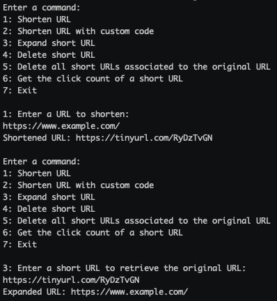

# URL Shortener - CLI Application

## Overview
This project is a proof of concept a URL Shortner service. It's a command-line application written in C# that
demonstrates the core functionality of URL shortening and redirection without the need for an actual web service or
persistent storage layer. The application allows users to create, delete, and retrieve short URLs, and track the number
of times a short URL has been accessed.

### Demo


## Features
- **URL Shortening**: Generate short URLs with a random generated code for a URL, with an option to enter a custom code.
- **URL Retrieval**: Get the original long URL from an existing short URL.
- **URL Deletion**: Delete short URLs from storage.
- **Click Tracking**: Track the number of times a short URL has been accessed.

## Getting Started
### Running the application
1. **Build and run the application**
   ```bash
   dotnet build
   dotnet run --project Client 
   ```
2. **Follow the instructions from the command prompt**
    1. The application will prompt a series of numbered commands
    2. Key in the number of the command you want to execute and press Enter
    3. Enter in the required parameters for the command and press Enter
    4. The application will execute the command and display the results

### Testing
   ```bash
   dotnet test
   ```
